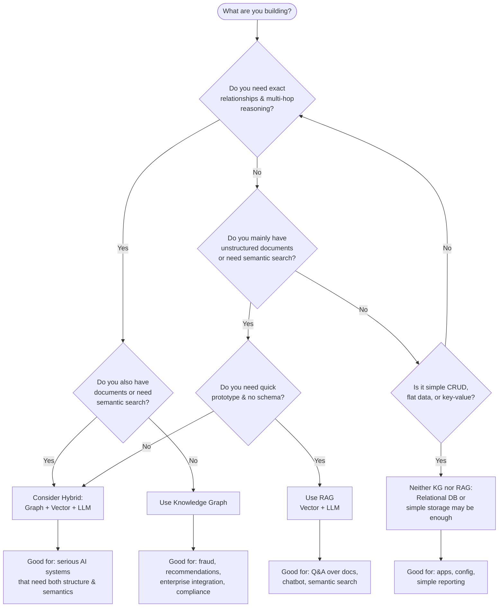

# Decision Guide: When to Use a Knowledge Graph, RAG, or Neither

**Status:** Draft — refine as you learn (especially after Phases 2, 7, and the small project).

**Purpose:** A flowchart-style guide to decide **when to use a Knowledge Graph**, **when to use RAG**, and **when not to use** either for your project.

---

## Flowchart (Mermaid)

---

## Short narrative (by outcome)

| Outcome | When it fits |
|--------|----------------|
| **Knowledge Graph** | You need **exact relationships**, **multi-hop queries**, deterministic answers, or use cases like fraud detection, recommendations, enterprise data integration, or regulatory compliance. Data is (or can be) structured into entities and relationships. |
| **RAG** | You mainly have **unstructured documents** (PDFs, articles), need **semantic search** or Q&A over a knowledge base, want a **fast prototype**, and don’t need strict multi-hop logic. |
| **Hybrid (Graph + Vector + LLM)** | You need **both** relationship reasoning and semantic/document search — e.g. graph for facts and structure, vector for “similar to this” and document context, LLM to combine and answer. |
| **Neither** | Your problem is **simple CRUD**, flat or key-value data, or well-served by a **relational database**. Adding KG or RAG would be unnecessary complexity. |

---

## References

- [RAG vs Knowledge Graph](rag-vs-knowledge-graph.md) — detailed comparison
- [Hybrid Architecture](hybrid-architecture.md) — graph + vector + LLM flow
- [plan.md](../plan.md) — learning phases (e.g. Phase 7 = hybrid)

---

*Edit this file as you complete more phases and get a clearer sense of when each approach fits.*
